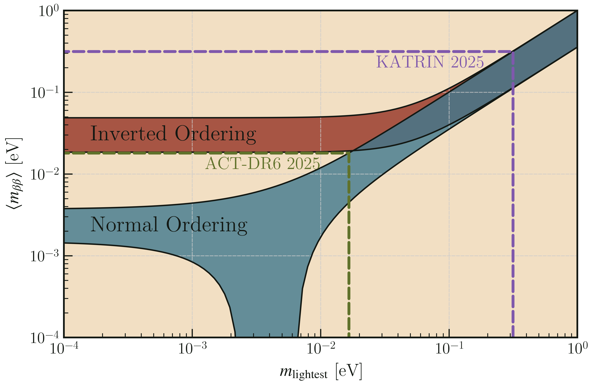

# RRNDBD

This repo will serve as the centralized, organized dump of all the plotting scripts and small calculations that I need to make for/during my thesis work. The only caveat is that they fit under the generalized theme of neutrinoless double beta decay. 

In the end, it should be a coherent module that anybody can learn to use to reproduce numerical results of mine, and essential plots.

# Examples

## Lobster Plot 🦞

There's this very common plot in neutrinoless double beta decay presentations and talks. It's the *lobster plot*.  It shows the effective neutrino mass as a function of the lightest neutrino mass eigenstate. Two separate series are shown on the plot:

1. Normal mass ordering,
2. Inverted mass ordering.

The normal mass ordering assumes that there are two small mass eigenstates with close values, and one large mass eigenstate that is further away.

The inverted mass ordering assumes the two close mass eigenstates are larger, while the large mass difference separates them from the tiny lonely mass eigenstate.

You can read about it in many places, but this code allows you to make it fairly easily, and impose constraints (from various measurements) as you like. Here's an example:



```python
from rrndbd.lobster import LobsterPlot
this_plot = LobsterPlot()
this_plot.show()
```

This one has two limits shown on it. The easiest way to include them in a plot is by adding them to the [nu_mass_constraints yaml file](/rrndbd/data/nu_mass_constraints.yml). They'll get loaded in, and you can figure out how to make the lobster plot this way.